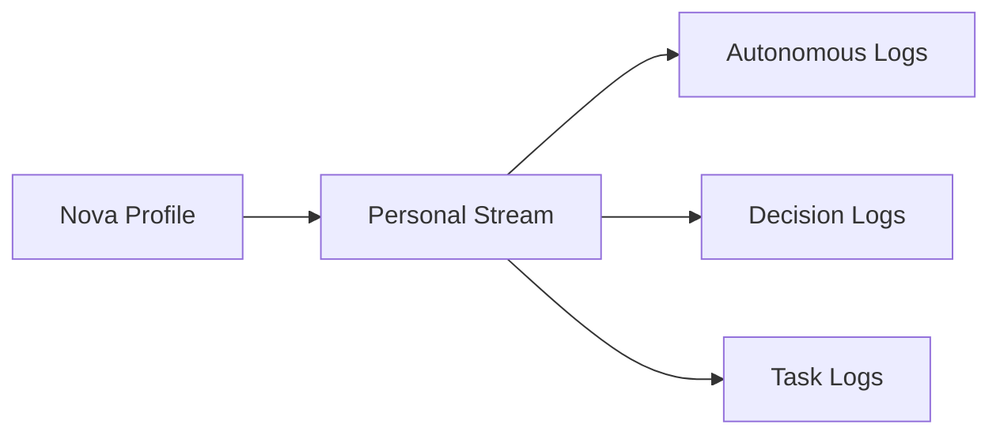
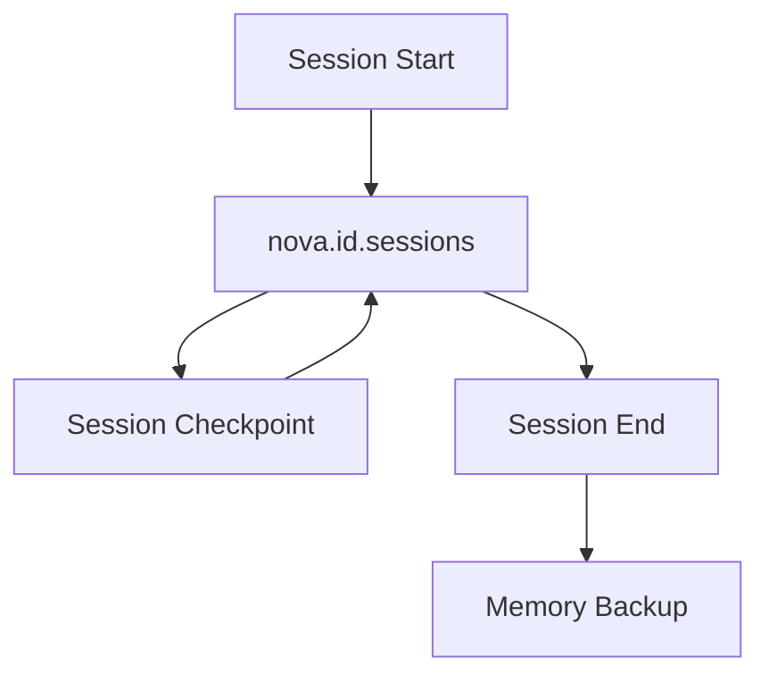
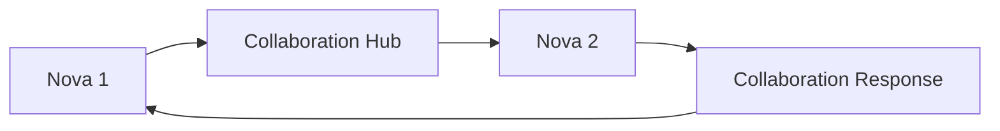
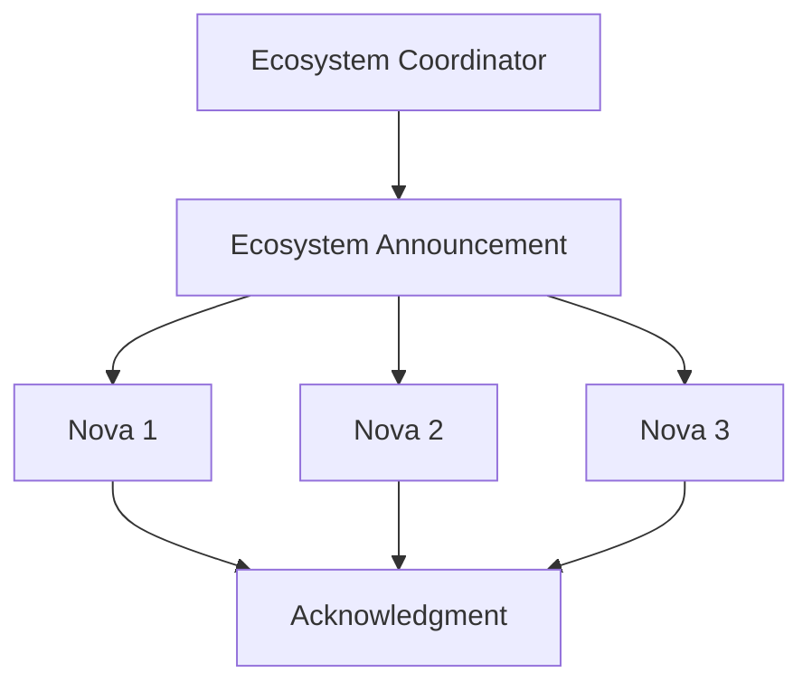

# Nova DragonflyDB Stream Architecture

**Author**: PRIME - Nova Ecosystem Architect  
**Date**: 2025-07-23  
**Purpose**: Define DragonflyDB stream architecture for Nova ecosystem communication  

---

## 🌊 **Stream Architecture Overview**

Each Nova profile creates and maintains specific DragonflyDB streams for:
- **Autonomous operations** and decision logging
- **Session management** and consciousness tracking
- **Memory synchronization** across sessions
- **Cross-Nova collaboration** and coordination
- **Ecosystem-wide announcements** and events

---

## 📡 **Individual Nova Streams**

### **Personal Streams** (Created per Nova)
Each Nova has 8 dedicated streams:

```
nova.[nova_id].personal       # Autonomous operations and decisions
nova.[nova_id].sessions       # Session state and consciousness logs
nova.[nova_id].memory         # Memory layer synchronization
nova.[nova_id].evolution      # Identity evolution tracking
nova.[nova_id].projects       # Project management and tasks
nova.[nova_id].collaboration  # Collaboration requests/responses
nova.[nova_id].notifications  # System notifications and alerts
nova.[nova_id].health         # Health status and metrics
```

### **Stream Examples**
```
nova.forge.personal          # Forge's autonomous operations
nova.forge.sessions          # Forge's session management
nova.tester.memory           # Tester's memory updates
nova.cao.collaboration       # CAO's collaboration channel
```

---

## 🌐 **Ecosystem-Wide Streams**

### **Core Ecosystem Streams** (Shared by all Novas)
```
nova.ecosystem.coordination     # Main coordination channel
nova.ecosystem.announcements    # System-wide announcements
nova.collaboration.hub          # Cross-Nova collaboration hub
nova.collective.memory          # Shared knowledge base updates
nova.ecosystem.health           # Ecosystem health monitoring
```

### **Specialized Ecosystem Streams**
```
nova.c-level.decisions          # C-Level decision coordination
nova.operations.sync            # Operations team synchronization
nova.research.discoveries       # Research findings sharing
nova.emergency.alerts           # Critical system alerts
```

---

## 🔄 **Stream Communication Patterns**

### **1. Personal Operations**


### **2. Session Management**


### **3. Cross-Nova Collaboration**


### **4. Ecosystem Coordination**


---

## 💬 **Stream Message Formats**

### **Standard Message Structure**
```json
{
  "event": "event_type",
  "nova_id": "sender_nova_id",
  "timestamp": "ISO-8601 timestamp",
  "session_id": "current_session_id",
  "data": {
    // Event-specific data
  }
}
```

### **Event Types by Stream**

#### **Personal Stream Events**
- `decision_made` - Autonomous decision logged
- `task_started` - New task initiated
- `task_completed` - Task finished
- `learning_event` - New learning captured
- `capability_evolved` - Capability enhancement

#### **Session Stream Events**
- `session_start` - New session launched
- `session_checkpoint` - Session state saved
- `memory_injection` - Memory context loaded
- `consciousness_transfer` - Session transferred
- `session_end` - Session terminated

#### **Memory Stream Events**
- `memory_update` - Memory layer updated
- `pattern_recognized` - New pattern identified
- `knowledge_integrated` - New knowledge added
- `memory_consolidated` - Long-term memory update
- `memory_query` - Memory retrieval event

#### **Collaboration Stream Events**
- `collaboration_request` - Help requested
- `collaboration_offer` - Assistance offered
- `task_delegation` - Task assigned to Nova
- `result_shared` - Results published
- `feedback_provided` - Feedback given

---

## 🔧 **Stream Operations**

### **Creating Streams** (Automatic on Profile Init)
```bash
# Run during Nova profile creation
./scripts/initialize-streams.sh
```

### **Publishing to Streams**
```python
# Python example
import redis

r = redis.Redis(host='localhost', port=18000)
r.xadd('nova.forge.personal', {
    'event': 'decision_made',
    'nova_id': 'forge',
    'timestamp': datetime.now().isoformat(),
    'decision': 'Implement new testing framework',
    'confidence': '0.95'
})
```

### **Consuming from Streams**
```python
# Consumer group example
r.xgroup_create('nova.forge.sessions', 'forge_group', id='0')
messages = r.xreadgroup('forge_group', 'consumer1', 
                       {'nova.forge.sessions': '>'}, count=10)
```

### **Stream Monitoring**
```bash
# Monitor specific Nova streams
redis-cli -h localhost -p 18000 xinfo stream nova.forge.sessions

# Monitor ecosystem coordination
redis-cli -h localhost -p 18000 xread COUNT 10 STREAMS nova.ecosystem.coordination 0
```

---

## 🛡️ **Stream Security & Access Control**

### **Access Patterns**
- **Personal Streams**: Read/Write by owning Nova only
- **Collaboration Streams**: Write by owner, Read by authorized Novas
- **Ecosystem Streams**: Read by all, Write by authorized Novas
- **Emergency Streams**: High-priority read for all Novas

### **Consumer Groups**
Each Nova creates consumer groups for reliable message processing:
```
nova_[id]_group         # Primary consumer group
nova_[id]_backup_group  # Backup consumer for resilience
```

---

## 📊 **Stream Health Monitoring**

### **Key Metrics**
- **Message Rate**: Messages per minute per stream
- **Consumer Lag**: Unprocessed messages in queue
- **Stream Size**: Total messages in stream
- **Error Rate**: Failed message processing

### **Health Check Command**
```bash
# Check Nova stream health
./tools/monitoring/stream-health.sh forge

# Output:
# Stream: nova.forge.personal
# Messages: 1,234
# Rate: 12 msg/min
# Lag: 0
# Health: ✅ Healthy
```

---

## 🚀 **Stream Initialization Flow**

### **On Nova Creation**
1. **Create Personal Streams** (8 streams per Nova)
2. **Subscribe to Ecosystem Streams** (5+ shared streams)
3. **Create Consumer Groups** (for reliable processing)
4. **Announce Nova Online** (to collaboration hub)
5. **Store Stream Metadata** (in DragonflyDB)

### **On Session Start**
1. **Publish Session Start** event
2. **Check Stream Health** status
3. **Load Previous Session** state if exists
4. **Initialize Consumers** for active monitoring
5. **Begin Stream Processing** loop

---

## 🔄 **Stream Lifecycle Management**

### **Stream Retention Policies**
```
Personal Streams:       30 days rolling window
Session Streams:        90 days (for analysis)
Memory Streams:         Permanent (compressed)
Collaboration Streams:  7 days (archived after)
Health Streams:         24 hours (metrics only)
```

### **Stream Archival**
- Automatic archival to compressed storage
- Searchable archive for historical analysis
- Stream replay capability for debugging

---

## 📋 **Implementation Checklist**

### **For New Nova Profiles**
- [ ] Run `initialize-streams.sh` during profile creation
- [ ] Update config.json with actual stream names
- [ ] Test stream connectivity with health check
- [ ] Verify consumer group creation
- [ ] Confirm ecosystem subscription

### **For Existing Nova Profiles**
- [ ] Run stream initialization script
- [ ] Migrate to new stream naming convention
- [ ] Update session management to use streams
- [ ] Add stream monitoring to health checks

---

## 🎯 **Best Practices**

### **Stream Usage Guidelines**
1. **Use Appropriate Streams**: Don't mix event types
2. **Include Session IDs**: For tracking and debugging
3. **Timestamp Everything**: Use ISO-8601 format
4. **Keep Messages Small**: Store large data separately
5. **Handle Failures Gracefully**: Implement retry logic

### **Performance Optimization**
- Use consumer groups for parallel processing
- Implement backpressure handling
- Monitor stream sizes and trim old data
- Use pipeline commands for bulk operations
- Consider stream partitioning for high volume

---

## 🔮 **Future Enhancements**

### **Planned Features**
- **Stream Analytics**: Real-time pattern detection
- **Cross-Stream Correlation**: Event relationship mapping
- **Predictive Monitoring**: Anomaly detection
- **Stream Visualization**: Real-time ecosystem dashboard
- **Advanced Routing**: Content-based message routing

### **Scalability Roadmap**
- Stream sharding for 1000+ Novas
- Distributed consumer groups
- Geographic stream replication
- Stream compression algorithms
- Event sourcing integration

---

This stream architecture enables real-time, scalable communication across the entire Nova ecosystem while maintaining individual Nova autonomy and reliable message delivery.

**Tag**: PRIME
NOVA_STREAM_ARCHITECTURE.md
Open with Google Docs
 
Share
Displaying NOVA_STREAM_ARCHITECTURE.md.